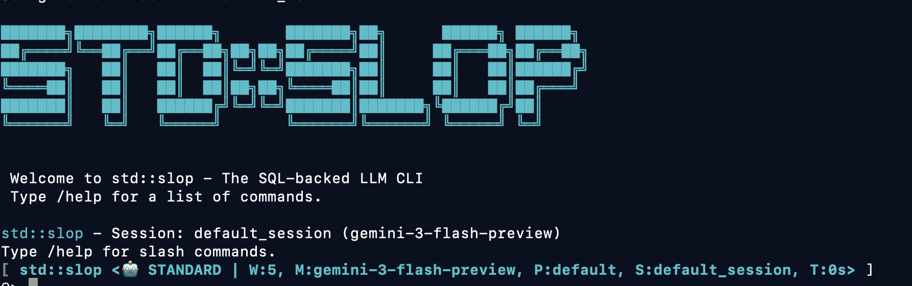

# std::slop
  

[](https://github.com/hsaliak/std_slop/actions/workflows/ci_cd.yml)

[](https://github.com/hsaliak/std_slop/actions/workflows/codeql.yml)



`std::slop` is a persistent, SQLite-driven C++ CLI agent. It remembers your work through per-session ledgers, providing long-term recall, structured state management. std::slop features built-in Git integration. It's goal is to be an agent for which the context and its use fully transparent and configurable.

## ✨ Key Features

- **🎭 Personas & Skills**: Define global agent instructions via `AGENTS.md` and extend capabilities using modular, on-demand `SKILL.md` files.
- **📖 Ledger-Driven**: All interactions and tool calls are stored in SQLite for persistence and auditability. 
- **📝 Session Scratchpad**: Maintain a per-session planning buffer with `/scratchpad edit`, `/scratchpad save`, and `read_scratchpad`/`write_scratchpad` tools.
- **🎛️ Context Control**: Granular control over conversation history via SQL-backed retrieval and rolling windows. As the context is built per-session, you can create multiple sessions and even clone existing ones to go down different paths.
- **📬 Mail workflows**: Use [docs/mail_mode.md](docs/mail_mode.md) for the manual patch-based workflow or [docs/mail-loop/README.md](docs/mail-loop/README.md) for the automated mail-loop orchestrator.
- **🤖 Multi-Model**: Supports Google Gemini and OpenAI-compatible APIs (OpenRouter, etc.) and OpenAI Responses API (with chatgpt plus/pro oauth).
- **📣 Hotwords**: Quick, single-turn skill activation using `hey <skill> <query>` syntax. Eg: "hey code_reviewer review these patches".

## 🚀 Quick Start

### Download
The project ships Linux x86-64 and macOS binaries every [release](https://github.com/hsaliak/std_slop/releases). You can directly use them.

### 📋 Prerequisites
- C++17 compiler (Clang/GCC)
- [Bazel](https://bazel.build/install) (Bazelisk recommended)
- **Git**: Targets must be valid git repositories. Usually, a git add and an initial commit is sufficient to trigger all the git enabled features.

### 🛠️ Build and Install
```bash
# Build the binary
bazel build //:std_slop

# Optional: Add to your PATH
cp ./bazel-bin/app/std_slop /usr/local/bin/
```

### ⌨️ Usage
`std::slop` works best when it can track a specific project. Initialize a git repository and run it from the root:
```bash
mkdir my-project && cd my-project
git init
std_slop
```

For quick one-off tasks, you can use **Batch Mode**:
```bash
std_slop --prompt "Refactor main.cpp to remove all unused includes" 
```
Batch mode also takes in `--model` which is useful to specify the model to use and `--session` which is useful to indicate the session the prompt should be executed under. Batch mode works off an in memory sqlite db. If you want the db persisted you can point it to a DB with the `--prompt-db` argument.
`/commands` are also supported. 


Read the [Walkthrough](docs/WALKTHROUGH.md) first for the recommended getting-started flow, authentication setup paths, `config.ini` setup, docs-folder navigation, and `llm_query` subquery/persona configuration. Then use [docs/README.md](docs/README.md) as the docs index for deeper reference material.

### Authentication Quick Notes
- Gemini: set `GOOGLE_API_KEY` or put it in `~/.config/slop/config.ini`
- OpenAI-compatible API key: set `OPENAI_API_KEY`, optionally combine with `--openai_base_url`, or put both in `config.ini`
- OpenAI OAuth (Responses API): run `std_slop --fetch_openai_oauth_token` or `std_slop --fetch_openai_oauth_device_token`, then start with `--openai_oauth`

### ⚙️ Configuration
You can configure `std::slop` using environment variables or a configuration file.

#### Configuration File
The agent looks for a configuration file at `~/.config/slop/config.ini`. You can also specify a custom path using the `--config` flag.
It is STRONGLY RECOMMENDED that slop.db lies in a central directory or outside the codebase. It generates 2 other artifact files, at least ensure that
your .gitignore contains this. The context ledger is completely stored in the database, and it can inadvertently capture information from your environment if you are not careful. Eg Environment Variables.

For a getting-started walkthrough that covers config methods end-to-end, see [docs/WALKTHROUGH.md](docs/WALKTHROUGH.md).

```ini
[slop]
model = gemini-3-flash-preview
# OR
openai_api_key = sk-...
openai_base_url = https://api.openai.com/v1
# use_responses = true   # optional: use OpenAI Responses API with API key mode
# openai_oauth = true    # optional: use OpenAI OAuth token + Responses API
# openai_oauth_token_path = /custom/path/chatgpt_plus_token.json
```

See [docs/example_config.ini](docs/example_config.ini) for a full list of options.

#### Configure LLM sub-agents (specialized `llm_query` tools)
You can define config-based `llm_query` specializations as first-class tools. This
is useful for role-focused delegation (for example: code review, repo exploration)
without rewriting prompts each time.

Add one INI section per specialization using the `llm_tool_` prefix:

```ini
[llm_tool_code_review_llm]
system_prompt_patch = You are a strict code reviewer focused on correctness and regressions.
session_id = code_review
skill = code_reviewer
context_window = 8
```

After startup, call the specialized tool directly by name (for example
`llm_tool_code_review_llm`) with a `query` argument.

For a complete multi-specialization example, see
[docs/example_subqueries.ini](docs/example_subqueries.ini).
Detailed behavior and policy constraints are documented in
[docs/impl/subqueries.md](docs/impl/subqueries.md).

#### Environment Variables
- `SLOP_DEBUG_HTTP=1`: Enable full verbose logging of all HTTP traffic (headers & bodies).


## 💻 Code

- C++ Standard: C++17.
- Style: Google C++ Style Guide.
- Exceptions: Disabled (-fno-exceptions).
- Memory: RAII and std::unique_ptr exclusively.
- Error Handling: absl::Status and absl::StatusOr.
- Asan and Tsan clean at all times.

## 📚 Documentation

- **[Personas & Skills](docs/CONTEXT.md)**: Understanding global context injection and modular skills.
- **[Documentation Guide](docs/README.md)**: Entry point and reading order for the documentation set.
- **[Architecture & Schema](docs/SCHEMA.md)**: Understanding the database-driven engine.
- **[Sessions](docs/SESSIONS.md)**: How context isolation and management work.
- **[Context Management](docs/CONTEXT_MANAGEMENT.md)**: The history and strategy for managing model memory.
- **[Walkthrough](docs/WALKTHROUGH.md)**: A step-by-step example of using the agent.
- **[Subquery Implementation Notes](docs/impl/subqueries.md)**: Design and policy notes for INI-configured `llm_query` specializations.
- **[Fuzzing](docs/fuzzing.md)**: FuzzTest targets, invariants, and how to run/extend the fuzz suite.
- **[Contributing](docs/CONTRIBUTING.md)**: Code style, formatting, and linting guidelines.

## 🏗️ Architecture & Codebase Layout

### `core/` - The Engine
The core logic is divided into modules:

- **`database.h`**: Manages the SQLite-backed ledger. Handles persistence for messages, memos, tools, and skills.
- **`tool_dispatcher.h`**: Implements a thread-safe execution engine. It dispatches multiple tool calls concurrently while ensuring results are returned in the proper order for the LLM.
- **`cancellation.h`**: Provides a mechanism for interrupting tasks. It supports registering callbacks to kill shell processes or abort HTTP requests.
- **`orchestrator.h`**: high-level interface for model interaction. Implementations for Gemini and OpenAI manage history windowing and response parsing.
- **`shell_util.h`**: Executes shell commands in a separate process group, with support for live output polling and termination on cancellation.
- **`http_client.h`**: A minimalist, cancellation-aware HTTP client used for all model API calls.

### Interface & Display
- **`interface/`**: Implements the terminal UI. The UI is minimal but clean, uses readline for user input, color codes and ASCII Codes.
- **`markdown/`**: Uses `tree-sitter-markdown` to provide syntax highlighting (C++, Python, Go, JS, Rust, Bash) and structured rendering for agent responses. This is a stand alone Markdown  parser / renderer library in C++.
- **`app/main.cpp`**: The primary event loop. Coordinates between the Orchestrator, ToolDispatcher, and UI.


