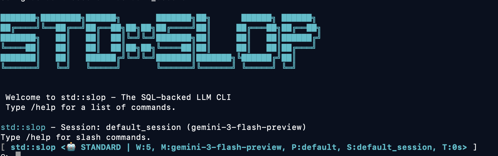

# Documentation Guide

`std::slop` is a C++ monorepo for agentic tooling. Choose a guide for the component you want to use; agent setup is not required for every library.

## Start here

- [Monorepo overview](../README.md) — component map, library quick starts, agent interfaces, and build commands.
- For interactive agent sessions, start with the [agent walkthrough](WALKTHROUGH.md).
- For scripting, start with the [sl CLI guide](sl.md).
- For C++ library APIs, use the library guides below.

## Use the coding agents

- [WALKTHROUGH.md](WALKTHROUGH.md) — installation, model authentication, configuration, first sessions, and subquery setup for the agent interfaces.
- [sl.md](sl.md) — scripted prompts, database selection, JSON output, and state subcommands.
- [mail_mode.md](mail_mode.md) — review-first work with small staging patches, verification, rerolls, and approved finalization.
- [mcp-slop-userguide.md](mcp-slop-userguide.md) — register and use external HTTP MCP tools in the agent runtime.

## Build with the C++ libraries

- [Markdown parser and renderer](../markdown/README.md) — Tree-sitter parsing, ANSI terminal rendering, highlighting, and API examples.
- [mcp-api.md](mcp-api.md) — outbound C++ MCP client API, Streamable HTTP, bearer tokens, and OAuth helpers.
- [MCP client package](../mcp/client/README.md) — revision selection and runnable client examples.
- [mcp-server.md](mcp-server.md) — inbound C++ stdio server API, echo example, framing limits, tests, and security scope.

The reusable server supports stdio only; the outbound client supports HTTP only. The server does not automatically export agent tools. The Markdown library and echo server do not need agent model credentials or a session database.

## Agent runtime reference

- [OAUTH.md](OAUTH.md) — model OAuth token setup, refresh, and token path overrides.

- [CONTEXT.md](CONTEXT.md) — global context injection, personas, and skills.
- [SESSIONS.md](SESSIONS.md) — session isolation, persistence, and cloning behavior.
- [SCHEMA.md](SCHEMA.md) — the coding-agent runtime's SQLite data model; not a dependency of every library.
- [CONTEXT_MANAGEMENT.md](CONTEXT_MANAGEMENT.md) — history/windowing strategy.

## Develop the monorepo

- [Repository layout](../README.md#repository-layout) — libraries, agent entry points, and shared runtime packages.
- [Build and test](../README.md#build-and-test) — full Bazel build and test commands.
- [CONTRIBUTING.md](CONTRIBUTING.md) — code style, formatting, and contribution guidance.
- [fuzzing.md](fuzzing.md) — fuzz targets, invariants, and maintenance guidance.

## Example Config Files

- [example_config.ini](example_config.ini) — baseline configuration template.
- [example_subqueries.ini](example_subqueries.ini) — example INI sections for specialized `llm_query` tools.

## Implementation Reference

- [impl/subqueries.md](impl/subqueries.md) — INI-defined `llm_query` tool contract.
- [mcp-server-simple.md](mcp-server-simple.md) — completed MCP server implementation bundles and acceptance checks.

## Reading paths

- **Interactive agent:** walkthrough → model authentication/configuration → sessions and mail workflows.
- **Scripted agent:** sl CLI guide → prompt/output rules → state and MCP integration guides.
- **Library caller:** component API guide → example source/build target → supported features and limits.
- **Contributor:** repository layout → contribution guide → tests and fuzzing.
