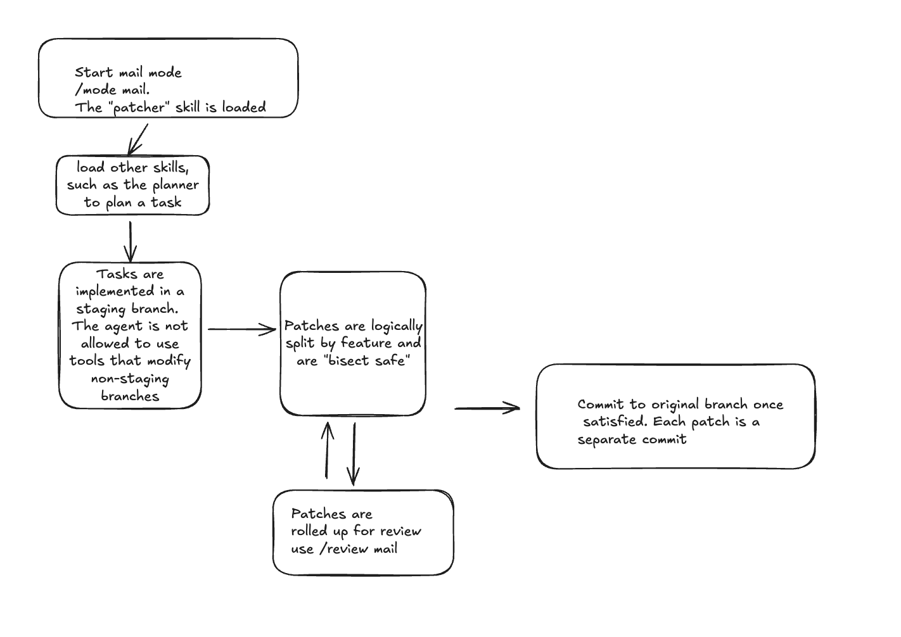

# The Mail Mode: Patch-Based Development Workflow

This document describes the manual Mail Mode workflow for `std::slop`.

**Audience:** users who want explicit control over staging branches, patch commits, review, and finalize.
**Related docs:** [mail-loop/README.md](mail-loop/README.md), [README.md](README.md), [../README.md](../README.md)

If you want the automated version of this workflow, see [mail-loop/README.md](mail-loop/README.md).

## 1. Core Philosophy

Mail Mode treats the agent as a remote contributor. Instead of making ad hoc changes directly on `main`, the agent builds a reviewable patch series on a staging branch. This encourages atomic commits, clearer rationale, and bisect-safe history.

## 2. High-Level Flow

1. Create or switch to a staging branch under `slop/staging/*`.
2. Implement a logical change.
3. Commit it with `git_commit_patch(...)`.
4. Repeat until the series is complete.
5. Run `git_format_patch_series(...)` to review the series.
6. Review, reroll, and verify until the series is ready.
7. Finalize with `git_finalize_series(...)` after explicit approval of the reviewed HEAD.

## 3. Staging Branch Workflow

- **Branching**: Use `git_create_staging_branch(base_branch, name)` to create or switch to a staging branch.
- **Atomic commits**: Keep each commit logically scoped and bisect-safe.
- **Rationale**: Use `git_commit_patch(summary, rationale)` so each patch records why it exists, not just what changed.
- **Verification**: Run a deterministic validation command before asking for review.

## 4. Review and Reroll

### Review

- Use `/review mail` to inspect the current series.
- Use `/review mail <index>` to inspect a specific patch.
- Add `R:` comments in the review buffer to request changes.

### Reroll

- Use `git_reroll_patch(base_branch, index)` to update a specific patch while preserving series structure.
- Re-run validation after each reroll.
- Re-review the updated series before finalization.

## 5. Verification and Finalization

- Use `git_verify_series(base_branch, command)` to validate every commit in the series.
- `git_finalize_series(target_branch)` merges the reviewed series and cleans up staging metadata.
- Approval must match the current staging HEAD. If the series changes after approval, it must be approved again.

## 6. Tool Summary

- `git_create_staging_branch(base_branch, name)`
- `git_commit_patch(summary, rationale)`
- `git_format_patch_series(base_branch)`
- `git_reroll_patch(base_branch, index)`
- `git_verify_series(base_branch, command)`
- `git_finalize_series(target_branch)`

## 7. Manual Mail Mode vs Mail Loop

### Manual Mail Mode

Choose this when you want to drive each step yourself:
- create the staging branch,
- decide patch boundaries,
- request and apply rerolls,
- approve and finalize manually.

### Mail Loop

Choose this when you want the agent to orchestrate the sequence end-to-end, including review iterations, approval bookkeeping, and finalization according to the `mail-loop` skill contract.

See [mail-loop/README.md](mail-loop/README.md) for that workflow.

## 8. Practical Tips

- Start with a clean working tree.
- Keep `slop.db` and related SQLite artifacts outside the repository or in `.gitignore`.
- Prefer several small patches over one large patch.
- Use the same deterministic validation command for local verification and `git_verify_series(...)`.
